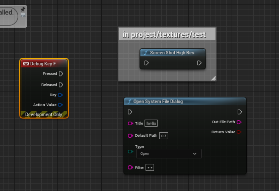
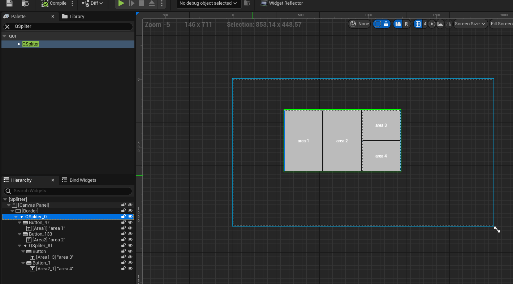

## Description

support 4.2x.x and 5.3.x

5.3.x new:

* .new feature:lumen high frame ouput and high shot to disk
* winapi implmentantion system open file dialog at runtime.

Tool Plugin.The UE4 Feature Extend and Feature Helper and contain some method about Texture/Pipe/WebBrowser/HTTP/IO/JSON

# Use Exam

##### 1.High Shot and open file dialog at runtime :

##### 2.umg splitter component widget:

Copy to QCorePlugin by 2024
